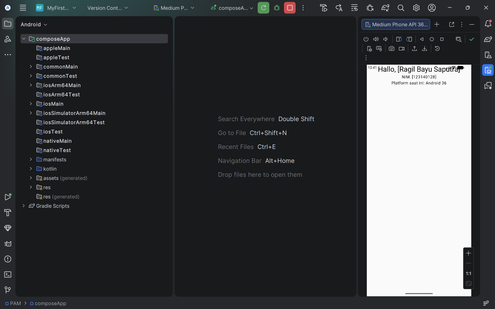

# Tugas Praktikum 1 - Pengembangan Aplikasi Mobile

Repository ini berisi proyek pertama Pengembangan Aplikasi Mobile menggunakan **Kotlin Multiplatform (KMP)**. Proyek ini menampilkan antarmuka sederhana yang mendeteksi platform yang sedang dijalankan.

## Data Mahasiswa
* **Nama:** Ragil Bayu Saputra
* **NIM:** 123140128
* **Program Studi:** Teknik Informatika

## Deskripsi Tugas
Modifikasi kode pada file `App.kt` untuk menampilkan:
1. Nama Lengkap Mahasiswa.
2. NIM (Nomor Induk Mahasiswa).
3. Platform yang sedang digunakan (Android/Desktop).

## Bukti Screenshot
Berikut adalah tampilan aplikasi saat dijalankan di Emulator Android:

## Teknologi yang Digunakan
* **Kotlin Multiplatform (KMP)**
* **Compose Multiplatform**
* **Android Studio & VS Code**